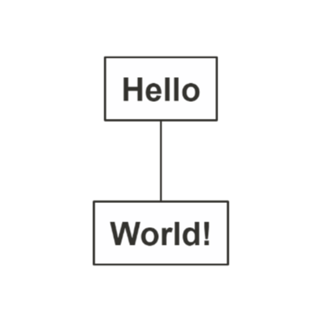
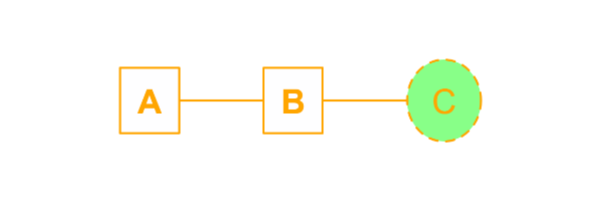
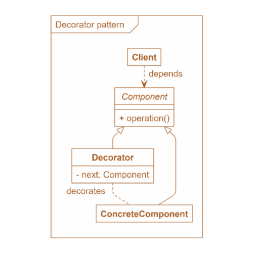

# nomnoml 

<!-- badges: start -->

[](https://github.com/rstudio/nomnoml/actions)
[](https://cran.r-project.org/package=nomnoml)
<a href="https://www.r-pkg.org/pkg/nomnoml"></a>
[](https://app.codecov.io/gh/rstudio/nomnoml?branch=main)
[](https://lifecycle.r-lib.org/articles/stages.html)
<!-- badges: end -->

**nomnoml** provides an R interface to
[nomnoml.js](https://www.nomnoml.com/), a tool for drawing sassy UML
diagrams based on syntax with customizable styling.

## Installation

Install from CRAN:

``` r
install.packages("nomnoml")
```

Or from GitHub using:

``` r
install.packages("remotes")
remotes::install_github("rstudio/nomnoml")
```

To use `nomnoml` in an R Markdown document, you also need to make sure
the external dependency on PhantomJS is available. You may either
download PhantomJS from its website, or use the function
`webshot::install_phantomjs()` to install it automatically.

``` r
install.packages("webshot")
webshot::install_phantomjs()
```

## Getting Started

You can create your first diagram by running:

``` r
nomnoml::nomnoml("[Hello]-[World!]")
```

<!-- -->

To make the diagram flow vertically, the default at
[nomnoml.com](https://www.nomnoml.com/), add the
[direction](https://github.com/rstudio/nomnoml/issues/5) directive:

``` nomnoml
#direction: down
[Hello]-[World!]
```

<!-- -->

You can also use `nomnoml` in R Markdown:

```` markdown
---
title: "A Diagram"
output: html_document
---

```{r, setup, include=FALSE}
library(nomnoml)
```

```{nomnoml}
#stroke: orange
#.box: fill=#8f8 dashed visual=ellipse

[A]-[B]
[B]-[<box>C]
```
````

<!-- -->

### SVG

To render using SVG, add `svg = TRUE`

``` r
nomnoml(diagram, svg = TRUE)
```

To render a `nomnoml` chunk in R Markdown, add `svg=TRUE` to the chunk
options

```` markdown
```{nomnoml, svg=TRUE}
#stroke: orange
#.box: fill=#8f8 dashed visual=ellipse

[A]-[B]
[B]-[<box>C]
```
````

<!-- -->

### Advanced

Notice that much more complex diagrams can be designed using `nomnoml`
by combining association types, classifier types, directives and custom
classifier styles.

``` nomnoml
#stroke: #a86128
#direction: down
[<frame>Decorator pattern|
  [<abstract>Component||+ operation()]
  [Client] depends --> [Component]
  [Decorator|- next: Component]
  [Decorator] decorates -- [ConcreteComponent]
  [Component] <:- [Decorator]
  [Component] <:- [ConcreteComponent]
]
```

<!-- -->

### Association types

    -    association
    ->   association
    <->  association
    -->  dependency
    <--> dependency
    -:>  generalization
    <:-  generalization
    --:> implementation
    <:-- implementation
    +-   composition
    +->  composition
    o-   aggregation
    o->  aggregation
    -o)  ball and socket
    o<-) ball and socket
    ->o  ball and socket
    --   note
    -/-  hidden
    _>   weightless edge
    __   weightless dashed edge

### Classifier types

    [name]
    [<abstract> name]
    [<instance> name]
    [<reference> name]
    [<note> name]
    [<package> name]
    [<frame> name]
    [<database> name]
    [<pipe> name]
    [<start> name]
    [<end> name]
    [<state> name]
    [<choice> name]
    [<sync> name]
    [<input> name]
    [<lollipop> lollipop]
    [<sender> name]
    [<socket> socket]
    [<receiver> name]
    [<transceiver> name]
    [<actor> name]
    [<usecase> name]
    [<label> name]
    [<hidden> name]
    [<table> name| a | 5 || b | 7]

### Directives

    #import: my-common-styles.nomnoml
    #arrowSize: 1
    #bendSize: 0.3
    #direction: down | right
    #gutter: 5
    #edgeMargin: 0
    #gravity: 1
    #edges: hard | rounded
    #background: transparent
    #fill: #eee8d5; #fdf6e3
    #fillArrows: false
    #font: Calibri
    #fontSize: 12
    #leading: 1.25
    #lineWidth: 3
    #padding: 8
    #spacing: 40
    #stroke: #33322E
    #title: filename
    #zoom: 1
    #acyclicer: greedy
    #ranker: network-simplex | tight-tree | longest-path

Directives only available when using the command line interface

    #import: my-common-styles.nomnoml

### Custom classifier styles

A directive that starts with “.” define a classifier style.

    #.box: fill=#88ff88
    #.blob: fill=pink visual=ellipse italic bold dashed
    [<box> GreenBox]
    [<blob> HideousBlob]

Available key/value pairs:

    fill=(any css color)

    stroke=(any css color)

    align=center
    align=left

    direction=right
    direction=down

    visual=actor
    visual=class
    visual=database
    visual=ellipse
    visual=end
    visual=frame
    visual=hidden
    visual=input
    visual=none
    visual=note
    visual=package
    visual=receiver
    visual=rhomb
    visual=roundrect
    visual=sender
    visual=start
    visual=table
    visual=transceiver

Available modifiers are

    center
    bold
    underline
    italic
    dashed
    empty
